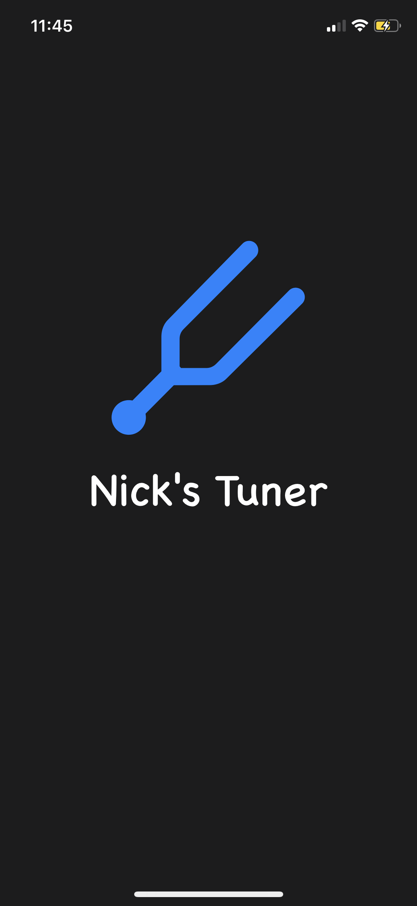
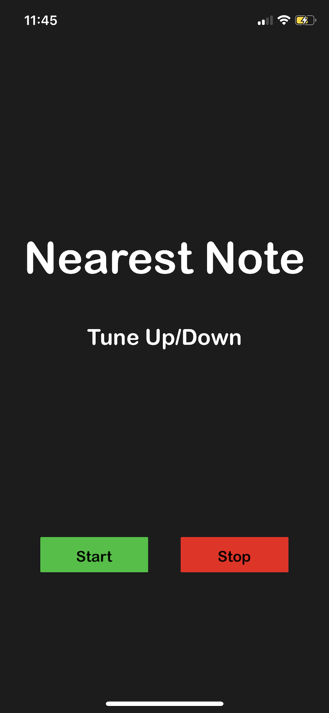

# Tuner-1
A tuner application that collects sound from the user, returns the nearest note to that frequency, and 
shows whether to tune up or down to that note with a 1% margin of error. FYI the AudioKit framework is not installed 
in this GitHub Repository and must be installed into the Xcode Project for the app to work.

# Screenshots

This is the initial launch screen.

This is initial homescreen that is shown on the app.

Once the user hits the start button, the mic on the phone takes in audio input and showcases the nearest note to that frequency. If the note is not in tune to that nearest note, it says to tune up or down and displays the note in red, depending on if the played note is too high or too low.

If the user gets within the 1% margin of error of the nearest note, the note is displayed in green and says "Got it" to the user.

